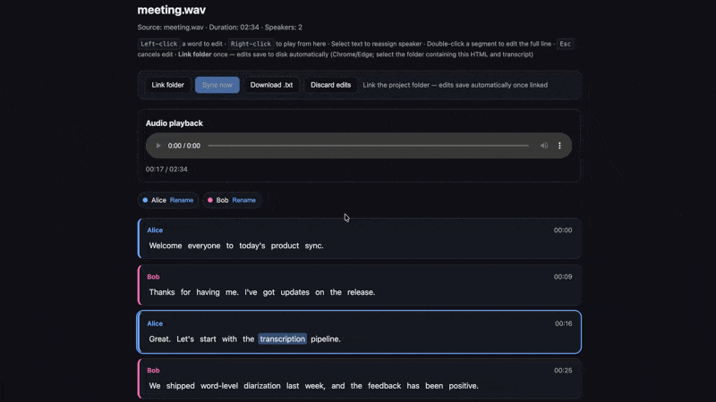

# MecoScribe



Local CLI for **diarized transcription** on macOS, built on [FluidAudio](https://github.com/FluidInference/FluidAudio). Upload an audio file and get a speaker-labeled transcript plus an interactive HTML viewer.

## Features

- **Diarized transcription** — identifies speakers and assigns words to each speaker
- **Plain-text output** — `<filename>.txt` with timestamps and speaker labels
- **Interactive HTML** — `<filename>.html` with:
  - Color-coded speaker segments
  - Word-level highlighting synced to playback
  - Click any word or segment to seek in the audio
  - Rename speakers
  - Built-in audio player (with playback speed selection)

## Requirements

- macOS 14+
- Swift 6.0+
- Apple Silicon recommended (uses CoreML / ANE via FluidAudio)
- Network access on first run (models download from Hugging Face)

## Install

```bash
git clone https://github.com/HeyMeco/MecoScribe.git
cd MecoScribe
swift build -c release
```

The binary is at `.build/release/mecoscribe`.

## Model cache

Downloaded FluidAudio models are stored in `./models` by default (relative to your current working directory). Subsequent runs reuse the cache instead of re-downloading.

Override with `--models-dir /path/to/models` or the `MECOSCRIBE_MODELS_DIR` environment variable.

## Usage

```bash
# Basic — writes meeting.txt and meeting.html next to the audio file
swift run mecoscribe meeting.wav

# Specify output directory
swift run mecoscribe interview.mp3 --output-dir ./transcripts

# Offline diarization (default) — multilingual ASR is used automatically
swift run mecoscribe call.m4a --output-dir ./transcripts

# English-only ASR (optional)
swift run mecoscribe english.wav --model-version v2

# Preset speaker names
swift run mecoscribe panel.wav --speakers "Alice,Bob,Carol"
```

### Options

| Flag | Description |
|------|-------------|
| `-o, --output-dir <dir>` | Output directory (default: same folder as audio) |
| `--models-dir <dir>` | Model cache directory (default: `./models`) |
| `--mode streaming\|offline` | Diarization mode (default: `offline`) |
| `--threshold <float>` | Speaker clustering threshold (default: `0.6`) |
| `--model-version v2\|v3` | ASR model — default `v3` (multilingual); use `v2` for English-only |
| `--model-dir <path>` | Use local ASR models instead of downloading |
| `--speakers <n1,n2,...>` | Initial speaker display names |
| `-h, --help` | Show help |

## Output

Given `meeting.wav`, MecoScribe produces:

- **`meeting.txt`** — readable transcript:

  ```
  [00:12] Speaker 1:
  Welcome everyone to today's meeting.

  [00:18] Speaker 2:
  Thanks for having me.
  ```

- **`meeting.html`** — open in any browser. The HTML references the original audio file via a relative path, so keep both files together (or open the HTML from the same directory).

## How it works

1. **Diarization** — FluidAudio identifies who spoke when (`offline` VBx pipeline by default)
2. **Transcription** — Parakeet ASR with word-level timestamps
3. **Alignment** — words are mapped to speakers by timestamp overlap
4. **Export** — plain text and self-contained HTML are written

## License

MecoScribe is licensed under the [MIT License](LICENSE).

FluidAudio models and runtime are subject to their respective licenses (MIT / Apache 2.0). See the [FluidAudio repository](https://github.com/FluidInference/FluidAudio) for details.
